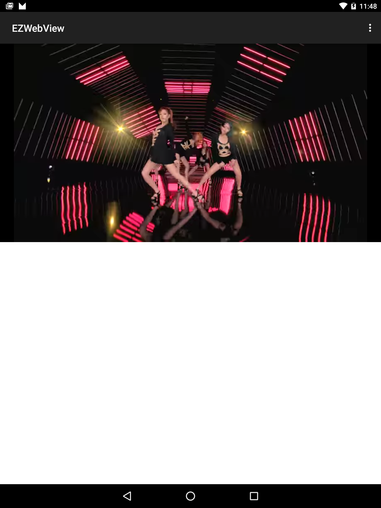

Advanced Webview [](https://travis-ci.org/jjhesk/EZWebView)[](http://android-arsenal.com/details/1/2390)[  ](https://bintray.com/jjhesk/maven/ezwebviewv/_latestVersion)
======
Latest Version v1.7.0
=======


Feature list
- [x] handler Google SSL alert #2
- [x] no more memory leak issue in video iframe
- [x] easy web page margin fixed
- [x] easy web video implementation
- [x] easy web content display implementation
- [x] took care of life cycle issues
- [x] fantasy animation reveal fade in
- [x] ```UriFactory``` set
- [x] ```Fx9C``` set
- [x] ```In32``` set
- [x] ```CommentBoxUrl``` resolve facebook, weibo, popbee comment issues
- [x] Support Post Method
- [x] support sound cloud
- [x] extra js script runtime
- [x] JsBridge integration, make a bridge between Java and JavaScript.
- [x] Youtube dialog display with material design.
- [x] Support inject additional CSS for webview load. (use HBCart client)

Download for the [Sample APK][2]

For initiating a webview, simply thing to do this to do it once for all.

[Demo example code][1]

Remote Repo
```gradle
    repositories {
        maven { url "http://dl.bintray.com/jjhesk/maven" }
    }
```
Dependency
```gradle
   compile 'com.hkm.ezwebview:ezwebviewv:1.7.0'
```


Step 1.
======
please locate in the xml for the video display
```xml

                <RelativeLayout
                    android:id="@+id/framevideoplayer"
                    android:layout_width="match_parent"
                    android:layout_height="@dimen/item_height_video"
                    android:background="@color/main_background"
                    android:padding="1dp"
                    android:visibility="gone">

                    <com.hkm.ezwebview.webviewleakfix.NonLeakingWebView
                        android:id="@+id/videoplayer"
                        android:layout_width="match_parent"
                        android:layout_height="wrap_content"
                        android:layout_centerInParent="true"
                        android:background="@color/main_background"
                        android:visibility="gone" />

                    <com.lsjwzh.widget.materialloadingprogressbar.CircleProgressBar               xmlns:fab="http://schemas.android.com/apk/res-auto"
                        android:id="@+id/progressloadingbarpx"
                        android:layout_width="wrap_content"
                        android:layout_height="wrap_content"
                        android:layout_centerInParent="true"
                        fab:mlpb_enable_circle_background="true"
                        fab:mlpb_inner_radius="18dp"
                        fab:mlpb_progress_color="@color/second_grey_bg"
                        fab:mlpb_show_arrow="false" />
                </RelativeLayout>
```
if you need to start a content display for html please also specify the xml as below:
```xml
   <RelativeLayout
                    android:id="@+id/content_article_frame"
                    android:layout_width="match_parent"
                    android:layout_height="wrap_content"
                    android:layout_marginBottom="10dp"
                    android:layout_marginLeft="10dp"
                    android:layout_marginRight="10dp"
                    android:visibility="gone">

                    <com.hkm.ezwebview.webviewleakfix.NonLeakingWebView
                        android:id="@+id/content_block"
                        android:layout_width="match_parent"
                        android:layout_height="match_parent"
                        android:visibility="gone"
                        tool:ignore="WebViewLayout" />
                </RelativeLayout>
```


### HTML content display area
=======
This is the fast simple implementation without any callbacks:

```java

  @Override
    public void onViewCreated(View v, Bundle b) {
        initBinding(v);
        final String contentc = fromFileRaw(getActivity(), R.raw.sample_html);
        try {
            Fx9C.setup_content_block_wb(this, content_article_frame, block, contentc);
        } catch (Exception e) {
            e.printStackTrace();
        }
        // if (bloadlistenr != null)
        //   bloadlistenr.onLoad();
    }

```

### This is the advanced implementation:

```java
  @Override
    public void onViewCreated(View v, Bundle b) {
        initBinding(v);
        final String contentc = fromFileRaw(getActivity(), R.raw.sample_html);
        try {
            Fx9C.setup_content_block_wb(this, content_article_frame, block, contentc, new HClient.Callback() {

                @Override
                public void retrieveCookie(String cookie_string) {

                }
            }, new Runnable() {
                @Override
                public void run() {
                    ViewCompat.animate(mprogressbar).alpha(0f).withEndAction(new Runnable() {
                        @Override
                        public void run() {
                            mprogressbar.setVisibility(View.GONE);
                        }
                    });
                }
            });
        } catch (Exception e) {
            e.printStackTrace();
        }
        // if (bloadlistenr != null)
        //   bloadlistenr.onLoad();
    }

```

### After enhancement
=======



### Video embeded content display area
=======
```java
 try {
            CircleProgressBar bprogressbar = (CircleProgressBar)this.findViewById(R.id.progressloadingbarpx);
            Fx9C.setup_web_video(
                    this,
                    video_frame,
                    mVideo,
                    bprogressbar,
                    video_embed_code_webvoew,
                    new HClient.Callback() {
                        @Override
                        public void startNewActivity(String s, String s1, String s2, Context context) {

                        }

                        @Override
                        public void startFeedList(String s, Context context) {

                        }

                        @Override
                        public void openUri(String s, Context context) {

                        }

                        @Override
                        public void retrieveCookie(String s) {

                        }
                    }, null);
        } catch (Exception e) {
            e.printStackTrace();
        }
```


### Register a Java handler function so that js can call

```java

    webView.registerHandler("submitFromWeb", new BridgeHandler() {
        @Override
        public void handler(String data, CallBackFunction function) {
            Log.i(TAG, "handler = submitFromWeb, data from web = " + data);
            function.onCallBack("submitFromWeb exe, response data from Java");
        }
    });

```

js can call this Java handler method "submitFromWeb" through:

```javascript

    WebViewJavascriptBridge.callHandler(
        'submitFromWeb'
        , {'param': str1}
        , function(responseData) {
            document.getElementById("show").innerHTML = "send get responseData from java, data = " + responseData
        }
    );

```

You can set a default handler in Java, so that js can send message to Java without assigned handlerName

```java

    webView.setDefaultHandler(new DefaultHandler());

```

```javascript

    window.WebViewJavascriptBridge.send(
        data
        , function(responseData) {
            document.getElementById("show").innerHTML = "repsonseData from java, data = " + responseData
        }
    );

```

### Register a JavaScript handler function so that Java can call

```javascript

    WebViewJavascriptBridge.registerHandler("functionInJs", function(data, responseCallback) {
        document.getElementById("show").innerHTML = ("data from Java: = " + data);
        var responseData = "Javascript Says Right back aka!";
        responseCallback(responseData);
    });

```

Java can call this js handler function "functionInJs" through:

```java

    webView.callHandler("functionInJs", new Gson().toJson(user), new CallBackFunction() {
        @Override
        public void onCallBack(String data) {

        }
    });

```
You can also define a default handler use init method, so that Java can send message to js without assigned handlerName

for example:

```javascript

    bridge.init(function(message, responseCallback) {
        console.log('JS got a message', message);
        var data = {
            'Javascript Responds': 'Wee!'
        };
        console.log('JS responding with', data);
        responseCallback(data);
    });

```

```java
    webView.send("hello");
```

will print 'JS got a message hello' and 'JS responding with' in webview console.

## Notice

This lib will inject a WebViewJavascriptBridge Object to window object.
So in your js, before use WebViewJavascriptBridge, you must detect if WebViewJavascriptBridge exist.
If WebViewJavascriptBridge does not exit, you can listen to WebViewJavascriptBridgeReady event, as the blow code shows:

```javascript

    if (window.WebViewJavascriptBridge) {
        //do your work here
    } else {
        document.addEventListener(
            'WebViewJavascriptBridgeReady'
            , function() {
                //do your work here
            },
            false
        );
    }

```

## Dialog webview implementation
For fragment that uses support.v4 package:
The youtube video ID will be taken in place

```javascript
   EzWebDialogNonLeakv4.newInstanceYoutube("_Oh9oSZSUbQ").show(getFragmentManager());
```

For normal support:

```javascript
   EzWebDialogNonLeak.newInstanceYoutube("_Oh9oSZSUbQ").show(getFragmentManager());
```


### Thank you for your support and we will bring more amazing libraries to your productive works. We are accepting bitcoin by the address as below. Please scan the QR code to start


License
--------

    Copyright 2015 jjHESK, HKM UNITED

    Licensed under the Apache License, Version 2.0 (the "License");
    you may not use this file except in compliance with the License.
    You may obtain a copy of the License at

       http://www.apache.org/licenses/LICENSE-2.0

    Unless required by applicable law or agreed to in writing, software
    distributed under the License is distributed on an "AS IS" BASIS,
    WITHOUT WARRANTIES OR CONDITIONS OF ANY KIND, either express or implied.
    See the License for the specific language governing permissions and
    limitations under the License.

[1]: https://github.com/jjhesk/EZWebView/tree/master/app/src/main/java/com/hkm/ezwebviewsample
[2]: https://docs.google.com/uc?authuser=0&id=0B5hHvje_X5v3eFU0d2VIWjhuRjA&export=download
